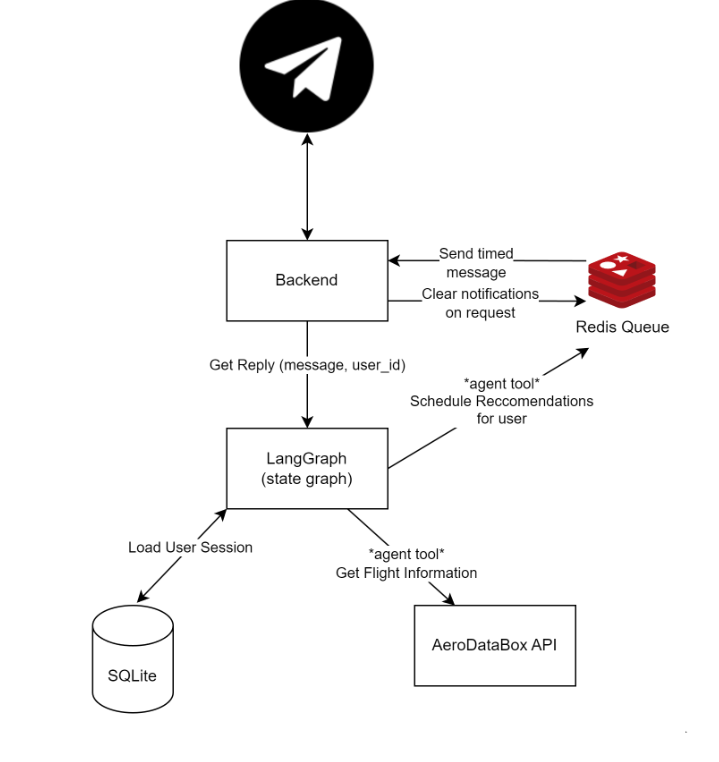
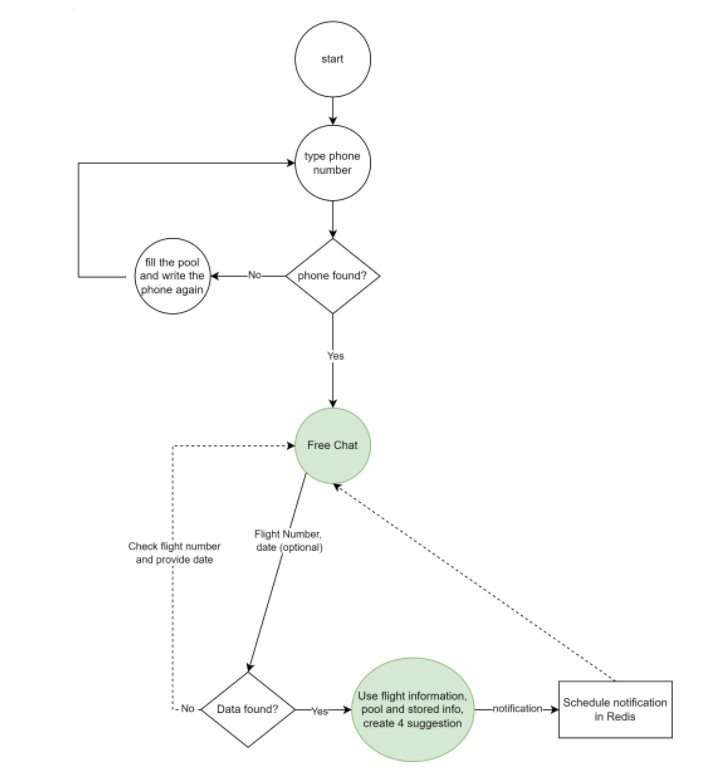

# Jetlag Fixes Bot

This repository contains a Python application to run the Teleram sleep suggestion bot. Below are the steps to build and run the application using Docker.

## Prerequisites

- Docker installed on your machine.

## Getting Started

Follow these steps to build and run the Docker container for the application:

### 1. Create a .env File

Create a `.env` file in the root directory of the repository with the following content:

```plaintext
OPENAI_API_KEY=your_openai_api_key
RAPID_API_KEY=your_rapid_api_key
RAPID_API_HOST=aerodatabox.p.rapidapi.com
TELEGRAM_TOKEN=your_telegram_bot_token
POLL_URL=https://docs.google.com/spreadsheets/d/1SmFRbVpG9nGqt3QocuxSHtYHsjKhaYnNZXraVTZgMqA/edit#gid=623571752
TEST_SCHEDULED_MESSAGES=1
REDIS_HOST=localhost
REDIS_PORT=6379
```
- OPENAI_API_KEY: Obtain from [OpenAI](https://platform.openai.com/).
- RAPID_API_KEY: Obtain from [RapidAPI](https://rapidapi.com/hub).
- TELEGRAM_TOKEN: Obtain by creating a bot on Telegram.

### 2. Build the Docker Image
Navigate to the root directory of the repository and run the following command to build the Docker image:
```
docker build -t jetlag_fixer .
```

### 3. Run the Docker Container
Run the Docker container using the command below. This command will start the Redis server, RQ worker, and the main application:
```
docker run -it jetlag_fixer
```


## Features
(funcional)
- Intelligent Suggestions: Provides intelligent suggestions based on users' sleep traits and the poll data.
- Scheduled Messages: Messages are scheduled daily from 12 PM the next day until 20 minutes before the flight time.
- Ability to delete scheduled notifications.

(non-functional)
- Multiple Users: Supports multiple users efficiently.
- Modular Architecture: The separation of LLM logic from the Telegram interface simplifies the addition of new interfaces.
- Separation of Logic and State: Utilizes a separated logic and state approach with user state graphs in SQLite, which is easily extendable to other databases.


## Architecture of the system


## Chat state graph


## Assumptions
- Unique Phone Numbers: Users will not search for other numbers, ensuring no duplicate phone numbers in the pool.
- Users won't try to use someone else's phone number